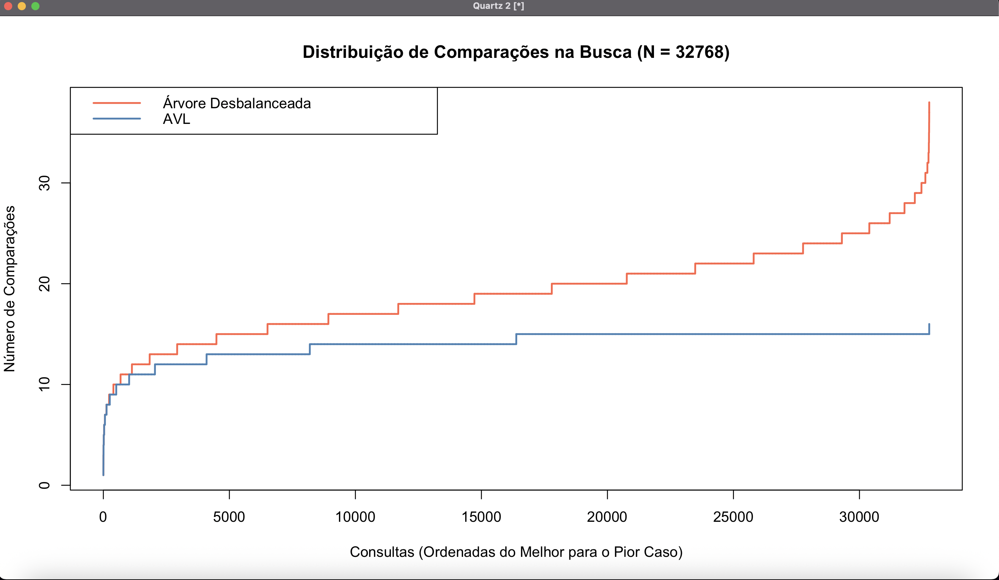

# Repositório dos Projetos de Estrutura de Dados 🚀

Projeto realizado para obtenção de nota na AB2 na disciplina de **estruturas de dados**.
O projeto traz inúmeros aprendizados na área de pesquisa operacional, principalmente pelo uso de algoritmos como o simplex.
Este repositório contém os seguintes projetos:

- Plotagem de Árvore desbalanceada x Árvore AVL
- SAT Solver
- SMT Solver
- Huffman para compactação de arquivo
- Seminário sobre máquina de Turing utilizando duas pilhas

## Plotagem de Árvore desbalanceada x Árvore AVL

Esse projeto foi uma pesquisa a fim de comparar o desempenho de uma árvore binária desbalanceada e uma árvore binária AVL (naturalmente balanceada). Foram utilizados 32768 números distintos (0 <= X <= 32768) inseridos de forma aleatória para ter um teste mais fiel à realidade.

Este foi o resultado:



**Nota-se que a árvore desbalanceada se aproxima de $\mathcal{O}(n^2)$.**

**É possível analisar também que a árvore AVL sempre permanece na curva logaritma proposta pela estrutura de dados. $\mathcal{O}(log(n))$**

**Além disso, é interessante destacar o **pico** no fim do gráfico da árvore AVL. Isso acontece porque há uma busca adicional para o valor 32768, uma vez uma árvore completa tem $\mathcal 2^n - 1$ itens.**

## SATSolver

SatSolvers são programas que resolvem um problema de satisfabilidade de uma fórmula booleana num formato CNF (Conjuntive Normal Form ou Forma Normal Conjuntiva).
O problema de satisfabilidade de uma fórmula booleana é considerado um problema NP-Completo (Nondeterministic Polynomial), ou seja, ainda não foi descoberto nenhuma forma eficiente (determinística) para resolver este problema.

O SATSolver implementado é dividido em quatro elementos principais

- Formula (Referente à fórmula inteira do problema, ou seja, um conjunto de cláusula)
- Clause (Referente a uma cláusula do problema)
- evaluateFormula (Função para avaliar a fórmula a partir de cada chute)
- sat (Função recursiva principal para validar e chutar um array de interpretações para ser avaliado)

Exemplo de arquivo de entrada <code>test.cnf</code>:

```text
    c 1 variável, 2 cláusulas
    p cnf 1 2
    1 0
   -1 0
```

Isso é equivalente a essa fórmula:
(A) ∧ (¬A)

Obviamente, esta fórmula resulta em **UNSAT**.

### Lógica por traz do algoritmo

O algoritmo realiza o parse do arquivo .cnf e transforma isso em cláusulas, o que gera uma fórmula. A partir disso, é utilizado um array de interpretação usando índice base como 1, permitindo que os literais (1, 2, 3) sejam os índices desse array.
Como próximo passo, o sat começa a testar valores para os literais alterando o array de interpretação parcial e montando a árvore de tentativas. Dessa forma, o programa consegue testar os caminhos para tentar verificar se uma fórmula é satisfazível ou não, utilizando como estado para os literais os valores:

```text
 1: True
-1: False
 0: Unassigned
```

### Backtracking

O resolvedor utiliza o algoritmo DPLL com um sistema de Backtracking Cronológico via recursão. Em vez de testar todas as combinações possíveis em uma matriz de tabela verdade completa ($\mathcal{O}(2^N)$), o motor avalia a fórmula a cada atribuição parcial. Se a função evaluateFormula detectar que qualquer cláusula tornou-se inteiramente falsa antes de todas as variáveis serem preenchidas, o algoritmo realiza uma poda por conflito: ele limpa os estados locais de volta para 0, aborta a descida naquele ramo e retrocede (backtrack) para tentar outro caminho.

## Contribuição 👨🏽‍💻

1. Helder Nicollas Leão Peixoto
2. Levy Abreu Cavalcante
3. Rafael Luiz Bandeira Almeida

**Este readme está em desenvolvimento... 👀**
